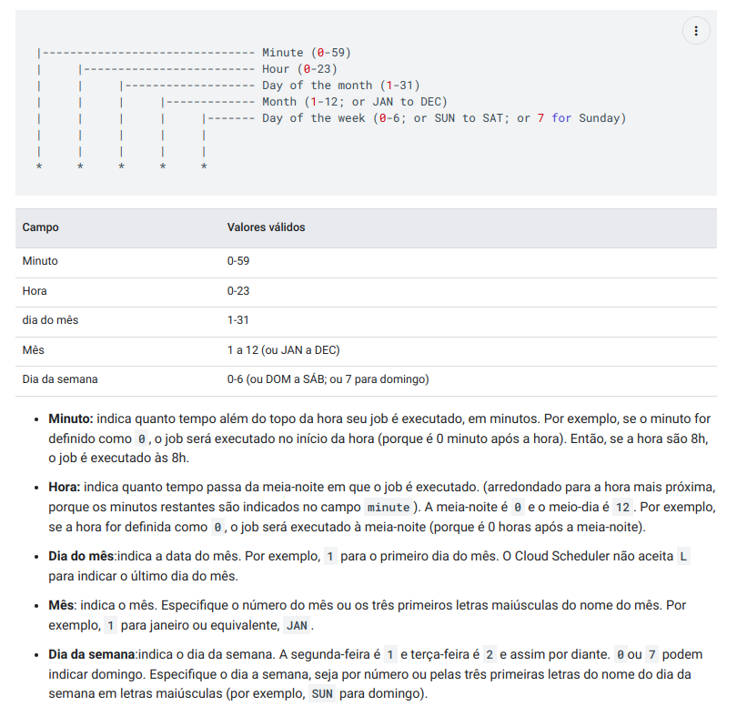

# Shell Scripts

Este repositório contém shell scripts que visam facilitar a realiazação de tarefas repetitivas e rotineiras.

Para poder usufruir destas funcionalidades siga os seguites passos:

1. Clone este repositório

```
git clone https://github.com/ajhopf/linux-scripts.git
```

2. Dê permissão para execução do arquivo de configuração

```
chmod 755 ./config.sh
```

3. Execute o script de configuração:

```
./config.sh
```

Você está pronto para utilizar as funcionalidade!

O script config.sh adiciona ao seu arquivo .bashrc 5 alias para executar as tarefas. Abaixo estes alias estão listados,
junto com a explicação de como utilizá-los.

# Atenção: todos caminhos passados para os comando serão adicionados à $HOME do usuário.

Exemplo: 

```
# o comando abaixo irá iniciar o projeto no diretório /home/<seu-usuario/workspace/projeto1

iniciarProjeto workspace/projeto1 
```

## iniciarProjeto

Alias utilizado para a rápida inicialização de um projeto.

```
iniciarProjeto <diretorio> <nomeDoProjeto>
```

Parâmetros:
* diretorio: caminho a partir da $HOME do usuário onde será criado o projeto
* nomeDoProjeto: nome do projeto.

Irá criar um projeto no caminho: /home/<seu-usuario>/diretorio/nomeDoProjeto;
Cria um arquivo README.md contendo o nome do projeto;
Cria um repositório local git e faz o primeiro commit.

## aczginit

Alias utilizado para iniciar uma nova branch na pasta atual

```
aczginit <nomeDaFeature>
```

Parâmetros:
* nomeDaFeature: nome utilizado para a criação da nova branch

Irá criar uma nova branch com o padrão "feature-$nomeDaFeature"
Irá fazer o checkout para esse nova branch
Irá mostrar no terminal as branchs locais e remotas

## aczgfinish

Utilizado para finalizar a branch de feature atual e fazer o merge na branch padrão.

```
aczgfinish 
```

Irá fazer o checkout para a branch padrão configurada para o git;
Faz o merge da feature branch;
Remove a feature branch localmente e do repositório remoto.

## scheduleTests

Alias utilizado para criar uma cron job para realizar os testes de um projeto gradle automaticamente.

```
scheduleTests <diretorio-do-projeto-gradle> [periodicidade]
```

Parâmetros:
* diretorio-do-projeto-gradle: caminho do diretório onde se encontra o projeto gradle a partir da $HOME do usuário;
* [OPCIONAL] periodicidade: Parâmetro opcional para configurar a periodicidade da execução da cron job.
  * Padrão: "0 12 * * *" -> será executado diariamente às 12h00.


fonte: https://cloud.google.com/scheduler/docs/configuring/cron-job-schedules?hl=pt-br

Exemplo:

```angular2html
scheduleTests wosrkspace/projeto "30 14 * * * "
```


### Arquivo de Log:

Os log originários da execução dos testes serão armazenados no arquivo:

Os logs originados da execução dos testes segue o padrão [ACZG_CI] [TESTS] ([SUCCESS]||[ERROR])

```
$HOME/logs/cronjob.log
```

## scheduleDailyCommit

Alias utilizado para criar uma cron job para realizar o commit automático de um projeto.

```angular2html
scheduleDailyCommit <diretorio-do-projeto> --m [mensagem-de-commit] --p [periodicidade]
```

Parâmetros:

* diretorio-do-projeto: caminho do diretório onde se encontra o projeto a partir da $HOME do usuário;
* [OPCIONAL] --p (periodicidade): Parâmetro opcional para configurar a periodicidade da execução da cron job.
  * Padrão: "0 13 * * *" -> irá ser executado todos dias as 13h00
* [OPCIONAL] --m (mensagem-de-commit): parâmetro opcional para configurar a mensagem de commit automática.
  * Padrão: "auto-commit: commit automático."


Exemplo:

```angular2html
scheduleDailyCommit wosrkspace/projeto --m "Commit automatizado" --p "30 14 * * * "
```

### Arquivo de Log:

Os log originários da execução dos commits serão armazenados no arquivo:

Os logs originados da execução dos commits segue o padrão [ACZG_CI] [COMMIT] ([SUCCESS]||[ERROR])

```
$HOME/logs/cronjob.log
```

## getLogs

Alias utilizado para mostrar no terminal apenas as linhas que mostram o resutado das execuções das cron jobs

```angular2html
getLogs
```